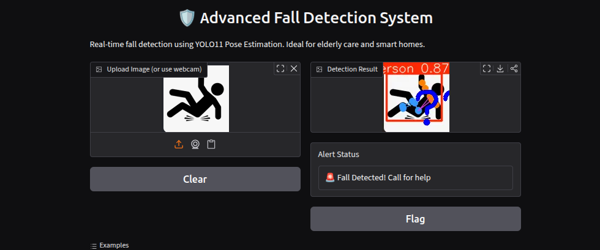

# 🛡️ Advanced Fall Detection System

A real-time fall detection system using **YOLO11 Pose Estimation**.

## Features
- Accurate pose-based fall detection
- Real-time image processing
- Clear visual alerts
- Easy-to-use web interface (Gradio)
- Suitable for elderly care, hospitals, and smart home applications

## Technologies
- Ultralytics YOLO11 Pose
- Gradio (Web Demo)
- OpenCV

## How to Run

1. Install dependencies:
   ```bash
   pip install ultralytics gradio
   ```
2. Run the app:
   ```bash
   python app.py
   ```
   1. Open the local URL shown in terminal.



### Future Improvements

Video stream support
SMS/Email alert integration
Mobile deployment


Made with ❤️ | Computer Vision Portfolio Project