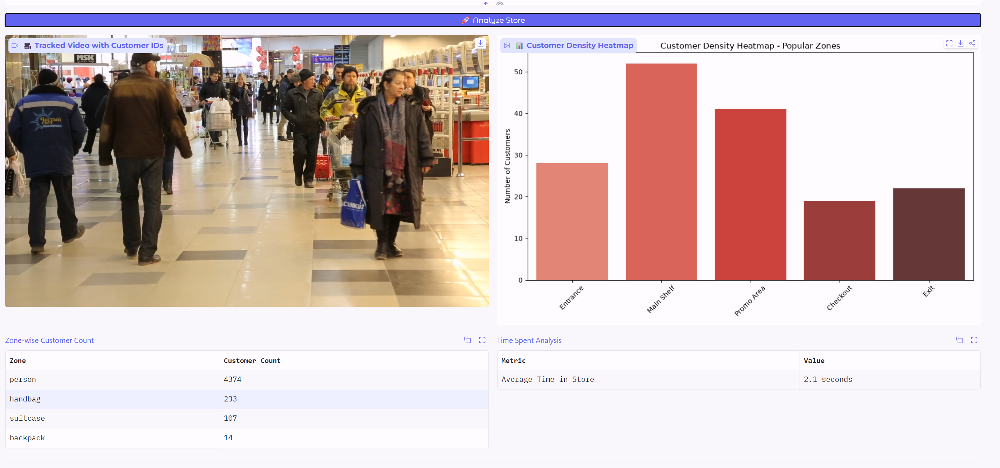

# 🚀 Computer Vision Portfolio

A curated collection of **advanced and impactful** Computer Vision projects.

  
*(Replace with your banner image later)*

---

## ✨ Featured Projects

### 1. Smart Traffic AI
- **Real-time vehicle detection, tracking & analytics**
- **Live Demo**: [Hugging Face Space](https://huggingface.co/spaces/Hayat373/smart-traffic-ai)
- **Tech**: YOLO11 + ByteTrack

### 2. Smart Retail Analytics 
- Customer tracking, heatmaps, zone analysis, time spent analysis 
- Business-focused solution for store optimization

### More Projects Coming Soon...
- Fall Detection System
- Thermal Night Vision
- Multi-Camera Tracking
- 3D Pose + Action Recognition

---

## 🛠 Technologies

- **YOLO11** (Detection, Segmentation, Pose, Tracking)
- Depth-Anything V2 (Depth Estimation)
- ByteTrack & Multi-Object Tracking
- Gradio (Interactive Demos)

---

## 📊 What Makes These Projects Strong

- Real-world applications
- Live interactive demos
- Clean code + professional documentation
- Focus on both **technical depth** and **business value**

---

## 🤝 Connect With Me

- **LinkedIn**: [linkedin.com/in/hayat-ahmedjara](https://www.linkedin.com/in/hayat-ahmedjara)
- **Email**: hayahmam3@gmail.com
- **Learning Journey**: [computer-vision-journey](https://github.com/Hayat373/computer-vision-journey)

---

**Made with ❤️ in Addis Ababa, Ethiopia**

---

Feel free to explore the projects and reach out if you have any questions or collaboration ideas!